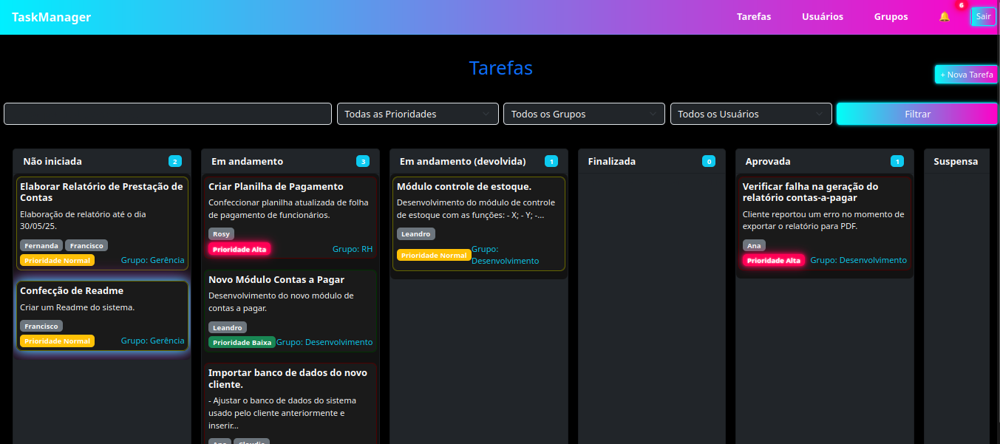
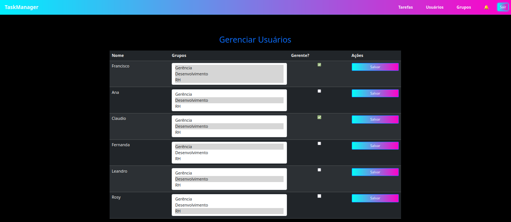
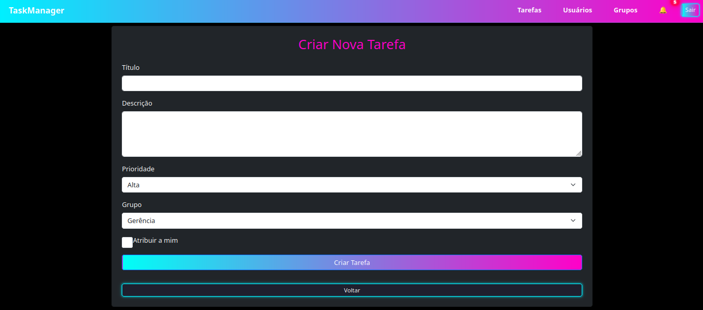
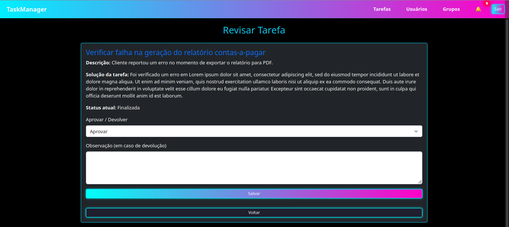
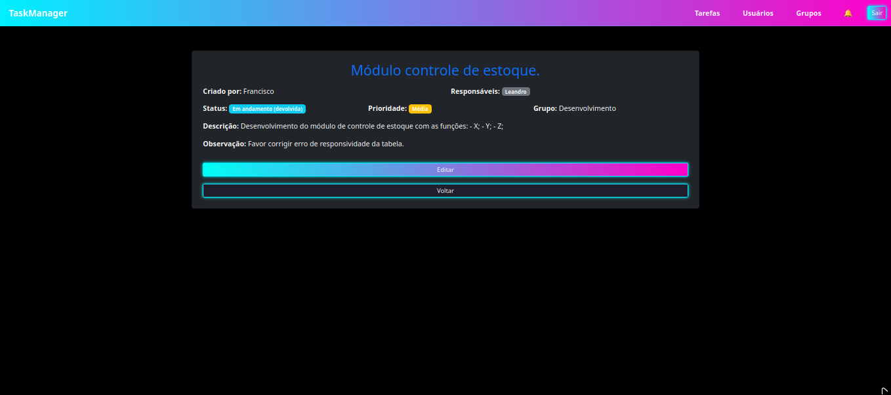
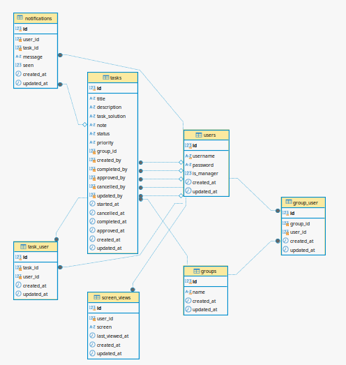

# 🛠️ Task Manager - Sistema de Gerenciamento de Tarefas

---

## ✨ Funcionalidades principais

- **Autenticação de Usuário**
  - Registro de novos usuários.
  - Login com validação de credenciais.
  - Exibição de mensagens de erro em caso de login ou registro inválido.

- **Gerenciamento de Tarefas**
  - Criação, edição e exclusão de tarefas.
  - Atribuição de usuários às tarefas.
  - Definição de prioridades: `Alta`, `Méida` e `Baixa`.
  - Definição de status da tarefa.
  - Associação de tarefas a **grupos**.

- **Sistema de Grupos**
  - Cada tarefa pertence a um grupo.
  - Usuários podem pertencer a um ou mais grupos.
  - Usuários que **não são gerentes** (`is_manager = false`) só visualizam tarefas dos grupos em que participam.

- **Notificações**
  - Ícone de notificações com contador.
  - Dropdown exibindo as últimas notificações do usuário.

- **Visualização de Novas Tarefas**
  - Controle interno para registrar a última vez que o usuário acessou a tela de tarefas.
  - Destaque luminoso automático em tarefas atualizadas após a última visita.

  Regras de Acesso

- **Regras de Acesso**
  - Gerentes (is_manager = true) têm acesso a todas as tarefas de todos os grupos.
  - Usuários comuns (is_manager = false) só visualizam tarefas dos grupos que participam e podem editar apenas tarefas sob sua responsabilidade.
  - Todas as ações são validadas para garantir segurança e integridade dos dados.

- **Layout Responsivo e Visual Neon**
  - Navbar fixa com botão de menu para dispositivos móveis.
  - Layout flexível para exibição das tarefas em colunas tipo **Kanban**.
  - Sistema de quebra automática de textos para manter a estética em todas as telas.

---

## 📸 Imagens do Sistema

### Dashboard

### Tela de Tarefas

### Tela Usuários

### Tela de Grupos

### Tela de Nova Tarefa

### Tela de Aprovação de Tarefa

### Tela Visualização de Tarefa

### Estrutura do Banco de Dados

---

## ⚙️ Tecnologias utilizadas

- [Laravel](https://laravel.com/) - Backend Framework PHP
- [Bootstrap](https://getbootstrap.com/) - Para responsividade e layout
- CSS personalizado - Tema Neon Synthwave
- [MySQL](https://www.mysql.com/) - Banco de dados relacional

---

## 🚀 Como rodar o projeto

1. Clone o repositório:
   git clone https://github.com/seu-usuario/seu-repo.git

2. Instale as dependências:
    composer install

3. Copie o arquivo .env.example para .env e configure com suas informações de banco de dados.

4. Rode as migrations:
    php artisan migrate
